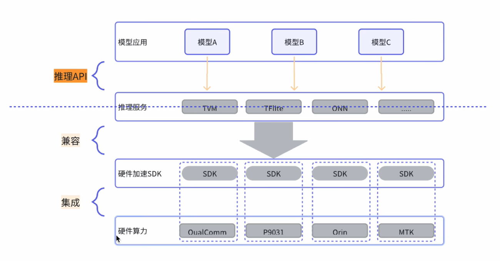
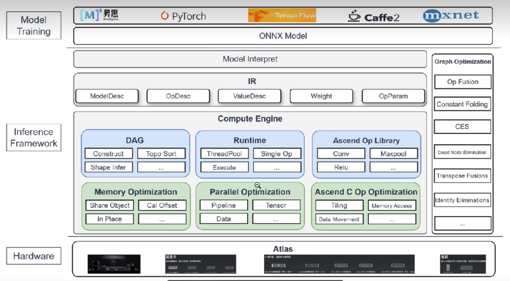
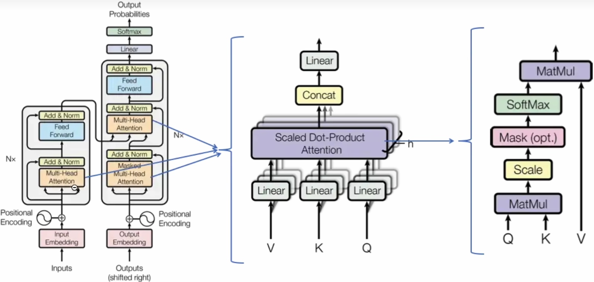
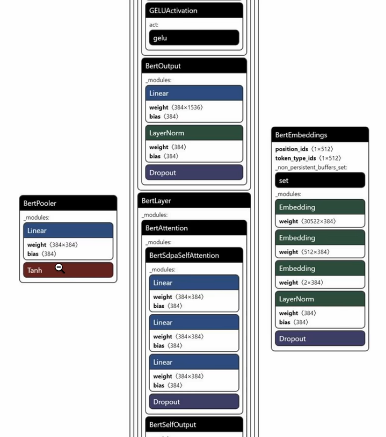
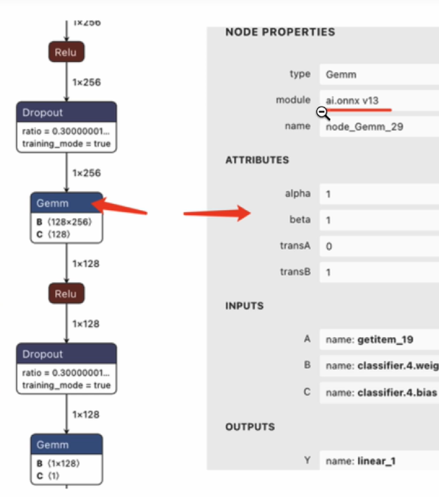
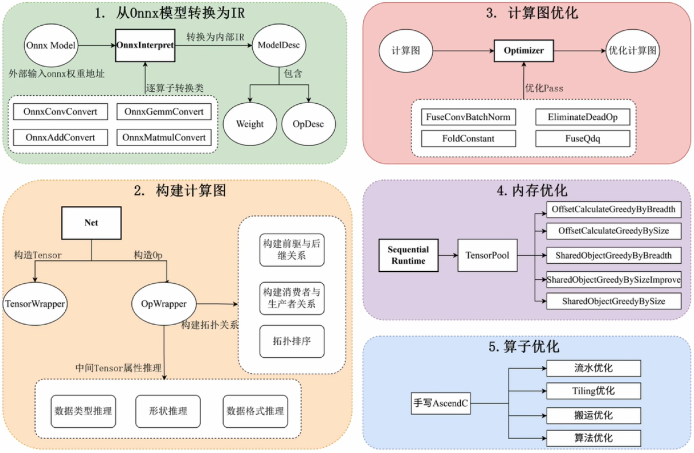
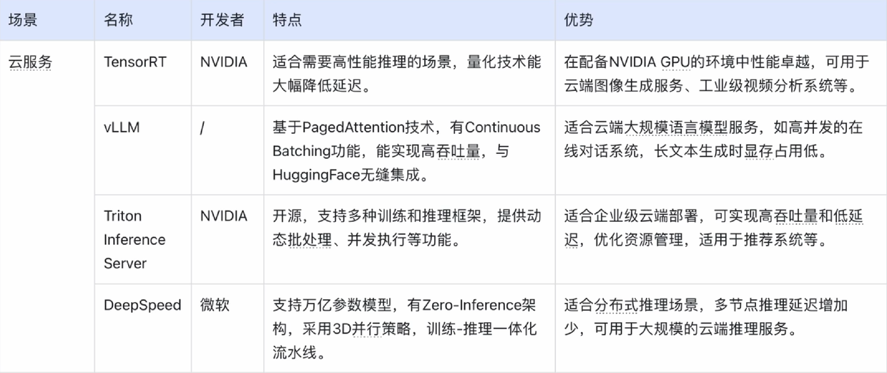
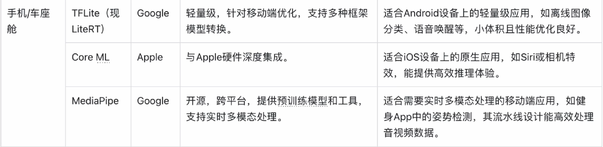
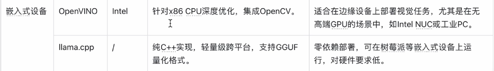

## 大模型推理引擎介绍

### 1.推理引擎在大模型中的位置

什么是推理引擎，为什么需要？

- 执行：执行模型程序

- 优化：屏蔽和匹配底层算力

最下面的就是我们常说的硬件，硬件说的最多的就是算力，除此之外，还有IO。

- 最底层：这里面关心最多的瓶颈在于硬件算力，算力也就是CPU或者GPU。

- 中间层：在硬件之上是硬件厂商提供的一层软件SDK，方便我们去使用他们的CPU或者GPU。

> 以上这两层其实在我们软件开发中基本很少涉及，我们只需要安装这些软件然后使用即可。

- 上层：在这个硬件加速的SDK之上，就是我们常说的推理引擎了（上图中的推理服务）

> 1.推理引擎会基于厂商所提供的SDK开放的硬件芯片的算力的一些接口，然后去跟对应的模型（最上层）衔接起来。

> 2.因此推理引擎其实起到一个承上启下的作用：将我们的模型跟下面的硬件隔离开；将模型的一些程序转换成推理服务中能够识别的一个个小的单元，然后把这些小单元排列组合放到我们的硬件资源上去做计算。（推理引擎主要就是做了这么一件事）

### 2.推理引擎的核心组件

【大模型推理引擎介绍】 https://www.bilibili.com/video/BV1bxYfzjERw/?share_source=copy_web&vd_source=b2932affb83f0bb3d8406ca58a791cee

推理引擎基本模块，我们只看推理框架（Inference Framework）的这3部分：
- 模型加载：Model Interpret，将最上层的模型去做对应的加载和翻译，并把它翻译成中间这一层的IR；
- 中间表示层：Intermediate Representation
- 计算引擎：Compute Engine，对中间层IR做计算和执行，把它转换成一个个的计算单元，最后把这些计算单元传递到最下层的硬件里面去。

**因此推理引擎的核心就在计算层这一块，它会对推理引擎的各个模块去做优化**。其中：

DAG：做图结构转换，因为模型的各个不同计算单元罗列到一起，其实就是一个低阶的图；

Runtime：做执行的，有多线程，线程池和一些队列；

Ascend Op Library：做算子加速库

Optimization部分：

- Memory Optimization：内存优化；
- Parallel Optimization：并行层面的优化；
- AscendC Op Optimization：算子加速层面的优化；

> 这三个优化其实是和上面的DAG，Runtime以及Ascend Op Library这三个部分对应起来的。

最右侧Graph Optimization：是一个个上下游单元。（这里跟图优化相关，只看上面推理优化三个部分就行了）

### 3.模型的结构

前面说到，推理引擎是执行模型（推理模型）的对应的程序，那模型的程序有什么样的特点呢？为什么需要有一个单独的引擎去执行呢？

能不能就一个普通的程序就跑完了，还需要单独用一个引擎吗？

---

这里面模型的结构就有它特殊的地方，现在模型越来越大，模型大家都认为它是个黑盒，从逻辑层面上来说确实是一个黑盒，但是从代码层面来讲它并不是黑盒，它有非常明显的一行一行的对应的指令。

这些指令是怎么来的，简单剖析一下：

拿常规的大模型结构（transformer的结构），看下这个结构如何转换成一个个执行单元。

**Transformer模型结构**

最左边的是transformer的经典结构，图中左侧是编码器（Encoder），右侧是解码器（Decoder）。

然后把其中的Muti-Head Attention细化成中间的这个结构，这个结构看上去仍然比较抽象。

把里面的Scaled Dot-Product Attention做进一步的细分，得到最右侧的这个结构，这个结构的数据含义就更加具体一点。比如：Matmul计算、Scale缩放计算，等等。

**模型算子图**

那如何把这些数学计算转换成代码的呢？这里用一个模型的可视化工具（Netron），把模型权重导入进去就可以看到模型结构。

**单个算子**

然后再点击其中的一个模块，可以看到更多细节，包括属性参数，输入和输出。这个就是我们常说的算子，它是模型结构中最小的计算单元。

以上就是从模型最原始的数学表达式一层一层的转换到我们的执行程序（代码）。

### 4.推理引擎的工作流程

#### 1）对模型做加载和转换

把模型层次结构加载进来，因为每个模型的格式都不一样，要把它转换成IR，对应的推理引擎能够识别的表达方式。

#### 2）得到schema并构建DAG图

得到IR之后，就到了下一步。

只有转换成推理引擎可识别的对应的schema之后，然后才能基于这些schema的上下游关系和依赖关系构建一个DAG图，那基于这些图谱的结构，才能确定哪些模块先算，哪些模块后算。

#### 3）图的优化部分

哪些模块先算，哪些模块后算，这其实就是图的优化部分。毕竟最终的期望是从图的叶子节点到最后的根节点，将整个算子都计算一遍，那么这计算的排列组合不同，导致达到的效果和使用方式也有很大的差异。

#### 4）内存的优化

这一步除了要编排每个算子之间的，每个节点之间的计算顺序。每个节点之间都有相互关系，那它的相互关系所对应的就有状态的保存以及每个节点他在使用计算的时候也会申请内存。

所以这里面会涉及大量的内存的申请和释放，并且上一个节点的输出，很有可能是下一个节点的输入，甚至下一个节点的输出，也有可能会成为我们下一次计算的上一个节点的输入。即每个节点的输入和输出都有可能被再次使用，因此为了避免某些内存被重复申请和释放，所以就要做大量的内存池，做一些内存层面的优化。

#### 5）算子的优化

算子是执行的最小单元，即单个图节点。单个图节点里面要么做乘加，或者做多维矩阵的乘法，甚至把多个乘加操作放到一起去做，都有可能形成一个小的计算单元。不同的计算方式都有可能达到不同的效果，因此这一步是对单个节点或者单个算子去做优化。

### 5.常见的推理引擎

一般分为这3类：

- 云端：大吞吐量，需要大量的推理服务，主要是云服务商，一些大厂，能够去部署自己的大模型和对外做推理。
- 边缘设备：需要快速响应和反馈，高性能，而没有大吞吐和高并发量的一个需求。聊得最多的，大部分场景和大部分公司，都是做这种，需要在单机上去部署，或者普通的台式机或PC，几个人的团队去用一个边缘设备。
- 嵌入式设备：小型设备，对功耗和性能和时延的要求会更高一点。对性能特别敏感，反而模型的复杂程度也会小很多，这个层面上的推理引擎基本上都是C语言，cpp，甚至是汇编去开发和使用。

### 6.如何自定义优化推理性能

推理引擎的核心是它的性能指标，但性能的维度可能不一样，有的要求吞吐量比较高，有的要求它的反应延迟比较高，有的要求它的内存率使用比较高，有的要求它的GPU的算力比较高。

如何定制化的去做优化？优化推理引擎主要有4个方面：

- 自定义算子：适合新增内置算子不支持的功能；

> 根据模型和业务的需求，比如我矩阵的计算有一些特殊性，比如有很多稀疏，把稀疏矩阵做了更多的特征处理，处理完了之后再计算，省了很多的开销和内存开销。

- 委托（Delegates）：适合将算子调度到专用硬件执行，是性能优化的主要方式；

> 比如有些场景下，我的GPU算力不够了，其中有些算子它不是矩阵计算，比如常规的逻辑计算，那就可以调度到CPU上去做计算。

- 算子融合：通过合并算子减少开销，依赖MLIR扩展；

> 也是算子层面的优化，算子多了，计算节点多了之后，需要做更多的数据的合并，或者上下游之间的内存的保存，如果这两个算子之间有直接的关系，放到一起反而可以使用更少的memory或者CPU。

- 量化定制：适配特殊量化需求，提升硬件利用率；

> 主要是针对业务场景来的，如果在这个业务中在硬件更弱一点的设备上跑，那么将8比特转成4比特去做对应的优化

#### 6.1 自定义算子（Custom Operator）

适用于实现TFLite内置算子不支持的功能，可在模型转换和推理阶段完成集成。核心依赖于**算子名称的匹配**和**注册器（OpResolver）**的映射机制。

**核心接口与流程：**

- 定义算子属性：通过TfLiteRegistration结构体注册算子的创建、初始化、执行、释放等回调函数；

- 模型转换适配：在TensorFlow模型中使用tf.raw_ops.UnknownOp占位，转换为TFLite模型时映射到自定义算子；

- 推理时注册：在解释器中注册自定义算子，确保TFLite能识别并执行。
